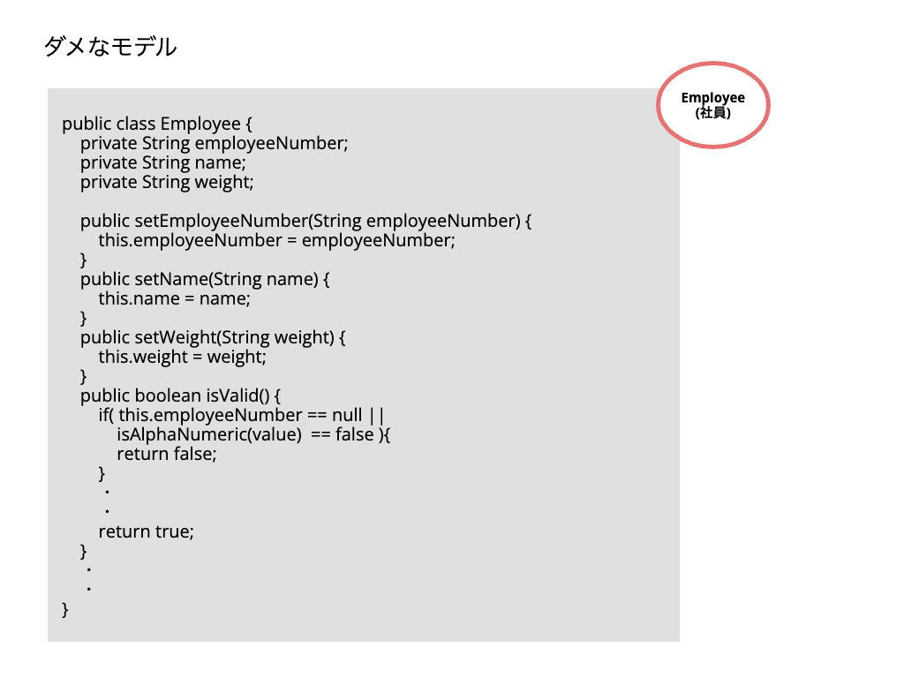
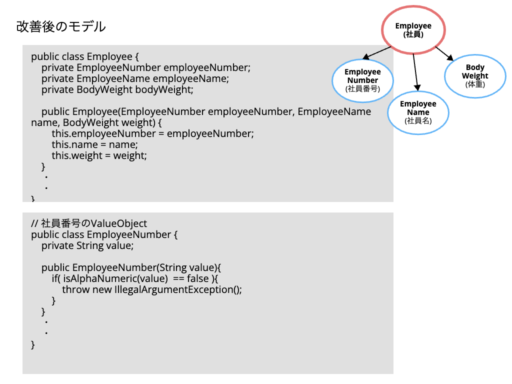

# DDD勉強会 前提知識

## ドメイン駆動設計 - DDD（domain-driven design）とは？
wikipedia より抜粋
> ドメイン駆動設計とは、ドメインの専門家からの入力に従ってドメインに一致するようにソフトウェアをモデル化することに焦点を当てるソフトウェア設計手法である。  
> オブジェクト指向プログラミングに関しては、ソースコード（クラス名・クラスメソッド・クラス変数）の構造と名称がビジネスドメインと一致させる必要があることを意味する。

意訳
> 実際の業務を深く理解して `ドメインモデリング` を行い、それをプログラムコードに落とし込むのに最適な実装手法`オブジェクト指向`でプログラミングしましょうね。ということ。

## ドメインモデリング
社員ID、名前、体重 を属性として持つ社員クラスの例

モデリングを放棄したダメな例

モデリングを意識した例

## エンティティとバリューオブジェクト
ドメインモデルをエンティティとバリューオブジェクトで表現する実装パターン

- エンティティ
  - 識別子を持つもの
  - 識別子が同じなら同じものとみなす
  - 例：ユーザー、書籍、注文
- バリューオブジェクト
  - 識別子を持たないもの
  - 値が同じなら同じものとみなす
  - 原則不変（イミュータブル）
  - 例：住所、日付、金額
  

## 集約
エンティティとバリューオブジェクトを実装しただけでは、業務を表現するには不十分な場合が多い。  
ドメインモデリングでは業務を`集約`として表現する。

## Javaパッケージ構造
JavaにおけるDDDフレンドリーなパッケージ構造

